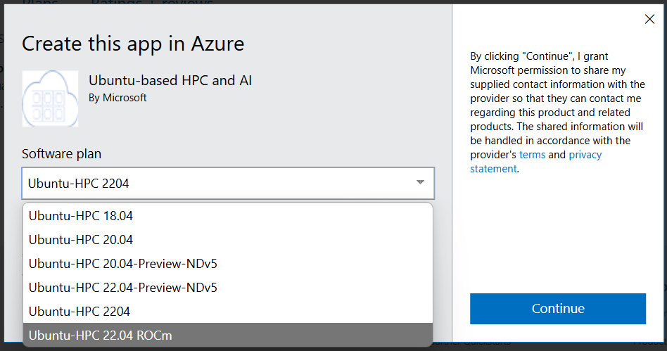

# Install AMD GPU drivers on Azure ND MI300X v5 Linux VMs

**Applies to:** :heavy_check_mark: Linux VMs

This document outlines the steps for installing and upgrading the AMD Linux Driver on an Azure ND MI300X v5 VM instance.Three key scenarios are covered:

* [Installing/Upgrading ROCm via the Marketplace Image](#image) - Recommended
* [Installing ROCm in Ubuntu 22.04](#driver-install)
* [Upgrading ROCm in Ubuntu 22.04](#driver-upgrade)


## Version Requirements

>[!NOTE]
> AMD's ROCm drivers currently only support MI300X on Ubuntu 22.04 with the 5.15 Kernel and ROCm 6.2.2.

- **OS**: Ubuntu 22.04
- **Kernel**: 5.15
- **ROCm**: 6.2.2
- **Secure Boot**: Disabled

<a id="image"></a>
## Installing/Upgrading ROCm using AzureHPC Marketplace Image - *Recommended*

Using the AzureHPC Marketplace Image is the recommended approach. The image already has the AMD and Infiniband drivers preinstalled. You can deploy either via the CLI or the Azure portal.

Via the CLI (```az vm create```) specify the image with ```--image microsoft-dsvm:ubuntu-hpc:2204-rocm:latest```.

Follow [this link](https://azuremarketplace.microsoft.com/en-us/marketplace/apps/microsoft-dsvm.ubuntu-hpc) to deploy via the Azure portal. Click "Get It Now" and choose "Ubuntu HPC 22.04 ROCm."



<a id="driver-install"></a>
## Installing ROCm in Ubuntu 22.04

### Verify Linux Distro

Confirm the system has a supported Linux version.
To obtain the Linux distribution information, use the following command:
``` bash
cat /etc/issue
```
Output is similar to the following example
```bash
# Ubuntu 22.04.5 LTS \n \l
```

### Downgrade Linux Kernel

To check the kernel version of your Linux system, use the following command:
```bash
uname -srmv
```
Output is similar to the following example

```bash
# Linux 6.8.0-1026-azure #31~22.04.1-Ubuntu SMP Thu Mar 20 04:12:50 UTC 2025 x86_64
```

Downgrade to the 5.15 version of the Linux kernel

```bash
 sudo apt install -y linux-headers-5.15.0-1073-azure
 sudo apt install -y linux-image-5.15.0-1073-azure
```

Upgrade the default grub menu option. The HASH is tied to the kernel revision count (XXXX in 5.15.0-XXXX-azure). It can be found in /boot/grub/grub.cfg

```bash
sudo sed -i "s|GRUB_DEFAULT=.*|GRUB_DEFAULT='gnulinux-advanced-5cec22f9-d9ef-44de-8258-c171f96f3dc4>gnulinux-5.15.0-1073-azure-advanced-5cec22f9-d9ef-44de-8258-c171f96f3dc4'|g" /etc/default/grub

sudo sed -i 's/^GRUB_CMDLINE_LINUX=.*/GRUB_CMDLINE_LINUX="panic=0 nowatchdog msr.allow_writes=on nokaslr amdgpu.noretry=1 pci=realloc=off console=ttyS0,115200n8 video=astdrmfb video=efifb:off ibt=off"/' /etc/default/grub

sudo update-grub
sudo reboot
```

*** **Important:** ***</mark> Confirm the downgraded version of your Linux kernel
```bash
uname -srmv
# Linux 5.15.0-1073-azure #82-Ubuntu SMP Mon Sep 2 11:36:34 UTC 2024 x86_64
```

Remove the old kernels

```bash
sudo apt purge -y linux-headers-6.*-azure linux-image-6.*-azure
```

<a id="amdgpu-install"></a>
### Install the AMDGPU drivers

Device driver installation instructions are provided [here](https://rocm.docs.amd.com/projects/install-on-linux/en/latest/install/amdgpu-install.html)

```bash
wget https://repo.radeon.com/amdgpu-install/6.2.2/ubuntu/jammy/amdgpu-install_6.2.60202-1_all.deb
sudo apt install ./amdgpu-install_6.2.60202-1_all.deb
sudo amdgpu-install --usecase=rocm
```

Confirm the AMDGPU driver version
```bash
cat /opt/rocm/.info/version
# 6.2.2-116
```

### Load the AMDGPU driver

Add yourself to the render and video group using the following command

```bash
sudo modprobe -r hyperv_drm
sudo modprobe  amdgpu ip_block_mask=0x7f
```

Verify the GPU driver installation with ```rocm-smi```:
```Bash
============================================ ROCm System Management Interface ============================================
====================================================== Concise Info ======================================================
Device  Node  IDs              Temp        Power     Partitions          SCLK    MCLK    Fan  Perf  PwrCap  VRAM%  GPU%
              (DID,     GUID)  (Junction)  (Socket)  (Mem, Compute, ID)
==========================================================================================================================
0       2     0x74b5,   65402  49.0°C      160.0W    NPS1, N/A, 0        131Mhz  900Mhz  0%   auto  750.0W  0%     0%
1       3     0x74b5,   27175  50.0°C      160.0W    NPS1, N/A, 0        132Mhz  900Mhz  0%   auto  750.0W  0%     0%
2       4     0x74b5,   16561  47.0°C      155.0W    NPS1, N/A, 0        131Mhz  900Mhz  0%   auto  750.0W  0%     0%
3       5     0x74b5,   54764  47.0°C      160.0W    NPS1, N/A, 0        131Mhz  900Mhz  0%   auto  750.0W  0%     0%
4       6     0x74b5,   10760  46.0°C      160.0W    NPS1, N/A, 0        131Mhz  900Mhz  0%   auto  750.0W  0%     0%
5       7     0x74b5,   48981  49.0°C      163.0W    NPS1, N/A, 0        132Mhz  900Mhz  0%   auto  750.0W  0%     0%
6       8     0x74b5,   32548  45.0°C      156.0W    NPS1, N/A, 0        131Mhz  900Mhz  0%   auto  750.0W  0%     0%
7       9     0x74b5,   60025  50.0°C      160.0W    NPS1, N/A, 0        131Mhz  900Mhz  0%   auto  750.0W  0%     0%
==========================================================================================================================
================================================== End of ROCm SMI Log ===================================================
```

<a id="driver-upgrade"></a>
## Upgrading ROCm in Ubuntu 22.04

Remove the ```amdgpu``` kernel module and uninstall rocm.
```bash
modprobe -r amdgpu
sudo amdgpu-uninstall
```
Follow the instructions to [install the AMDGPU drivers](#amdgpu-install) to install the new drivers.
