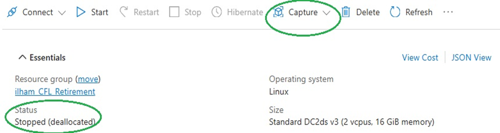
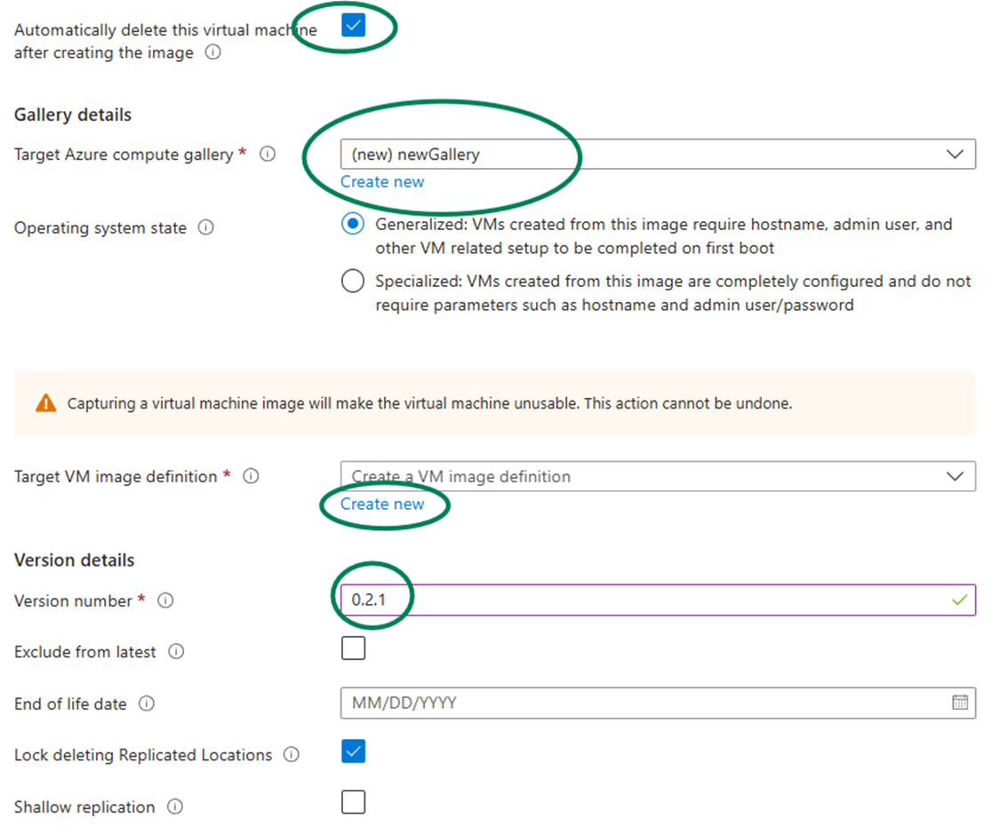
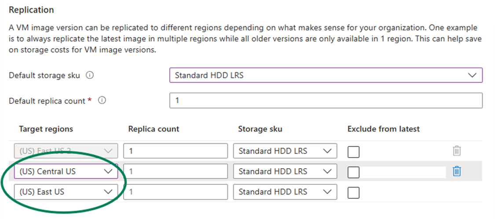

# DCsv2-series retirement

This migration guide is designed for users of DCsv2-series virtual machines (VMs), which are scheduled for retirement on **June 30, 2026**. To ensure minimal disruption and to continue optimizing cost and performance, this guide helps you transition to the latest series VMs.

This document covers:
- Recommended options for migration
- Detailed migration steps
- Frequently Asked Questions

By migrating to newer VM series, you gain access to improved price-performance ratios, broader regional availability, and the latest hardware capabilities.

### How does the DCsv2-series retirement affect me?
If you are running your workload on DCsv2-series SKU, either by using virtual machines, Virtual Machine Scale Sets (VMSS) or by having app-enclave aware containers running on Azure Kubernetes Service (AKS), this retirement will affect you.

After June 30, 2026, any remaining DCsv2-series virtual machine subscriptions will stop working, and will no longer incur billing compute charges.

## Recommended options for migration

**Before June 30, 2026**, migrate your workloads to one of the following options that best aligns with your business needs:

- If you want to continue leveraging the enclave-based offering with Intel SGX technology, migrate your workloads to [DCdsv3 virtual machines](https://learn.microsoft.com/azure/virtual-machines/sizes/general-purpose/dcdsv3-series?tabs=sizebasic). The DCdsv3 VMs offer significant improvements, including enhanced performance and increased memory capacity, making the DCdsv3-series a more robust and efficient choice.
- To lift and shift into a VM based programming model, consider [DCasv5/DCadsv5/ECasv5/ECadsv5](https://learn.microsoft.com/azure/virtual-machines/sizes/general-purpose/dcadsv5-series?tabs=sizebasic) VMs, [DCasv6/ECasv6](https://techcommunity.microsoft.com/blog/azureconfidentialcomputingblog/preview-new-dcasv6-and-ecasv6-confidential-vms-based-on-4th-generation-amd-epyc%E2%84%A2/4303752) series (currently in preview) or [DC](https://learn.microsoft.com/azure/virtual-machines/sizes/general-purpose/dcesv6-series?tabs=sizebasic)/[ECesv6](https://learn.microsoft.com/azure/virtual-machines/ecesv5-ecedsv5-series) (currently in preview) confidential VMs (CVMs).
- If you already have or plan to transition to containerized workloads and want to lift and shift your containerized applications consider using [Azure Confidential Container Instances (C-ACI)](https://learn.microsoft.com/azure/container-instances/container-instances-confidential-overview) serverless infrastructure. If you need to orchestrate containerized workloads, consider using [Virtual nodes on Azure Container Instances (C-VN2) for Azure Kubernetes Service (AKS)](https://learn.microsoft.com/azure/container-instances/container-instances-virtual-nodes).

Additionally, there may be changes to your Azure Virtual Machines billing because of this retirement. Refer to our Azure Virtual Machines [pricing page](https://azure.microsoft.com/pricing/details/virtual-machines/linux-previous/) for more information.

## Migration Steps
Start planning your migration from DCsv2-series today.

### Identify the Target Migration Option
- Learn more about the different migration options and their benefits in the section above.
- Evaluate your current VM's workload and performance requirements and identify the target migration option.

### Check and Request Quota Increases
- Before resizing and migration, verify that your subscription has sufficient quota for the target VM series.
- Request more quota through the [Azure portal](https://learn.microsoft.com/azure/azure-portal/supportability/per-vm-quota-requests) if needed.

### Complete Migration
- Complete migration as soon as possible to prevent business impact and to take advantage of the improved performance, and extensive regional coverage of our new confidential computing offerings.
- Dependent on chosen migration option follow the documentation below.
- For technical questions, issues, and help get answers from community experts in [Microsoft Q&A](https://learn.microsoft.com/search/?terms=confidential%20computing&category=QnA).

## Migrate workloads to DCdsv3-series VMs
To continue leveraging the enclave-based offering with Intel SGX technology, migrate your workloads to DCdsv3 virtual machines. First, check if your desired DCdsv3-series SKU is available in your current region. If it is, you can resize your virtual machines to the DCdsv3-series using the Azure portal, PowerShell, or the CLI. Below are examples of how to resize your VM using the Azure portal, PowerShell and Azure CLI.


> **Important notice:**<br><br> Resizing a virtual machine results in a restart. We recommend that you perform actions that result in a restart during off-peak business hours.<br>
Deallocating the VM also releases any dynamic IP addresses assigned to the VM. The OS and data disks are not affected.<br><br>
Additionally, if your DCsv2 VMs are running in North Central US, Canada East, Australia Southeast, or UK West, please follow the instructions in the next section.


### Azure portal

1. Open the [Azure portal](https://portal.azure.com).
1. Type *virtual machines* in the search.
1. Under **Services**, select **Virtual machines**.
1. In the **Virtual machines** page, select the virtual machine you want to resize.
1. Stop (deallocate) the VM.
1. In the left menu under Availability + scale, select  **Size** option.
1. Pick a new DCdsv3 size from the list of available sizes and select **Resize**.
1. **Start the VM** after resizing.

Refer to the full [Azure VM resizing guide](https://learn.microsoft.com/azure/virtual-machines/sizes/resize-vm?tabs=portal) for more detailed instructions.

### Azure PowerShell

1. Open a Powershell session
1. Authenticate your device and set your subscription.

    ```powershell
    Connect-AzAccount –UseDeviceAuthentication
    Set-AzContext -SubscriptionName "Your-Subscription-Name"
    ```
 
1. Set the resource group and VM name variables. Replace the values with information of the VM you want to resize.

    ```powershell
    $resourceGroup = "myResourceGroup"
    $vmName = "myVM"
    ```

1. Stop the VM.

    ```powershell
    Stop-AzVM -Name $vmName -ResourceGroupName $resourceGroup
    ```
1. List the VM sizes that are available on the hardware cluster where the VM is hosted.

    ```powershell
    Get-AzVMSize -ResourceGroupName $resourceGroup -VMName $vmName
    ```
1. Resize the VM to the new size.

    ```powershell
    $vm = Get-AzVM -ResourceGroupName $resourceGroup -VMName $vmName
    $vm.HardwareProfile.VmSize = "<newDCdsv3VMsize>"
    Update-AzVM -VM $vm -ResourceGroupName $resourceGroup
    Start-AzVM -ResourceGroupName $resourceGroup -Name $vmName
    ```
### Azure CLI

1. Open a terminal session and ensure you have Azure CLI installed (or use the portal cli)
1. Authenticate your device and set your subscription.

    ```powershell
    az login
    az account set --subscription "<subscriptionIdHere>”
    ```
 
1. Set the resource group, VM name and new size variables. Replace the values with information of the VM you want to resize.

    ```powershell
    resourceGroup="myResourceGroup"
    vmName="myVM"
    newSize=<newDCdsv3VMsize> # ex: Standard_DC24ds_v3
    ```
1. Resize the VM to the new size.

    ```powershell
    az vm deallocate --resource-group $resourceGroup --name $vmName
    az vm resize --resource-group $resourceGroup --name $vmName --size $newSize
    az vm start --resource-group $resourceGroup --name $vmName
    ```


### Important Notice for DCsv2 VMs running in North Central US, Canada East, Australia Southeast, or UK West
If your DCsv2 VMs are running in North Central US, Canada East, Australia Southeast, or UK West, please consider migrating them to the available regions listed below where the DCdsv3 SKU is available or explore our new generation of confidential computing offerings.

>Available Regions:<br> 
Australia East, Canada Central, Central India, Central US, East US, East US 2, West US, West US 2, South Central US, Germany North, Germany West Central, Italy North, Japan East, Japan West, North Europe, South India, Southeast Asia, UK South, West Europe, UAE Central, UAE North, Switzerland North

To migrate your VMs to one of these available regions, follow these steps:
1. Identify the **target region** from the list above.
1. Prepare your VMs for migration by ensuring all data is backed up.
1. Verify that your subscription has sufficient quota for the DCdsv3-series VMs in the target region. Request a quota through the [Azure portal](https://learn.microsoft.com/azure/azure-portal/supportability/per-vm-quota-requests) if needed.
1.	Navigate to VM you want to resize in the portal.
1.	**Stop the VM** and wait for status of the VM to be Stopped (deallocated).
1. Find the **Capture** drop down in the overview tab of the VM (circled bellow). From the drop down select **capture**, then image.  

1. When you reach **the image creation page**:
    * Ensure you select **Automatically delete this virtual machine** after creating the image.
    * If you do not have a gallery, select **Create new** in the gallery option and name your gallery.
    * Fill in the name and other required options. 
    * Create an image definition if none are available.
    * Read the descriptions for specialized vs generalized images and choose your option.  (If not sure, generalized should work for most cases.)

    * Continue to fill in the other options. In the replication section of the image capture option, add the region where you wish to relocate your VM. You will need to select the target region from the dropdown menu.
    
1. Go to your gallery and select the image you captured. In the top left, select **Create a VM**. 
    * Fill in all options and ensure you select the new region and new size.
    * If you do not see the size you want, ensure **No infrastructure redundancy required** is selected and that your requested region supports the desired size. 

## Migrate to new generation offerings 
- To lift and shift into a VM based programming model, consider [DCasv5/DCadsv5/ECasv5/ECadsv5](https://learn.microsoft.com/azure/virtual-machines/sizes/general-purpose/dcadsv5-series?tabs=sizebasic) VMs, [DCasv6/ECasv6](https://techcommunity.microsoft.com/blog/azureconfidentialcomputingblog/preview-new-dcasv6-and-ecasv6-confidential-vms-based-on-4th-generation-amd-epyc%E2%84%A2/4303752) series (currently in preview) or [DC](https://learn.microsoft.com/azure/virtual-machines/sizes/general-purpose/dcesv6-series?tabs=sizebasic)/[ECesv6](https://learn.microsoft.com/azure/virtual-machines/ecesv5-ecedsv5-series) (currently in preview) confidential VMs (CVMs).
- If you already have or plan to transition to containerized workloads and want to lift and shift your containerized applications consider using [Azure Confidential Container Instances (C-ACI)](https://learn.microsoft.com/azure/container-instances/container-instances-confidential-overview) serverless infrastructure. 
- If you need to orchestrate containerized workloads, consider using [Virtual nodes on Azure Container Instances (C-VN2) for Azure Kubernetes Service (AKS)](https://learn.microsoft.com/azure/container-instances/container-instances-virtual-nodes).

## Frequently Asked Questions

### What is the migration timeline?
On June 30, 2026, DCsv2-series virtual machines (VMs) will be retired. Before that date, please migrate your workloads to DCdsv3-series virtual machines. In case you prefer global availability and want to lift and shift your workloads consider using [DCasv5/DCadsv5/ECasv5/ECadsv5](https://learn.microsoft.com/azure/virtual-machines/sizes/general-purpose/dcadsv5-series?tabs=sizebasic) VMs, [DCasv6/ECasv6](https://techcommunity.microsoft.com/blog/azureconfidentialcomputingblog/preview-new-dcasv6-and-ecasv6-confidential-vms-based-on-4th-generation-amd-epyc%E2%84%A2/4303752) series (currently in preview) or [DC](https://learn.microsoft.com/azure/virtual-machines/sizes/general-purpose/dcesv6-series?tabs=sizebasic)/[ECesv6](https://learn.microsoft.com/azure/virtual-machines/ecesv5-ecedsv5-series) (currently in preview) confidential VMs (CVMs), or [Azure Confidential Container Instances (C-ACI)](https://learn.microsoft.com/azure/container-instances/container-instances-confidential-overview) serverless infrastructure. 

### Will DCsv2-series VMs still allow new customer sign-ups?
**Starting from July 1, 2025**, capacity restrictions will be applied to DCsv2-series virtual machines and no new subscription will be allowed.

### Will Microsoft continue to support my current workload?
Yes, support will continue for your workloads on DCsv2 virtual machines until the retirement date. You'll continue to receive SLA assurance, infrastructure updates and maintenance.

### Will other services built on top of the DCsv2 SKU still be available after the SKU retires?
No, all uses of the DCsv2 SKU will retire simultaneously in June 2026, including those on AKS and VMSS.

### Will DCsv2-series VMs provide any new features during the retirement period?
No, we won't be taking any feature requests or building new features for the DCsv2-series VMs. Instead, we'll focus on next-generation lift-and-shift offerings with more memory per vCPU, faster SSD storage, global availability, and a cloud-native approach with containerized workloads and serverless infrastructure.

### Will DCsv2-series and DCsv3-series VMs be available in new regions?
No, we won't deploy DCsv2-series, DCsv3-series and DCdsv3-series VMs in new azure regions. Please check availability in the existing DCsv3/DCdsv3 regions.

### I am using EPID Attestation (IAS). Can I continue using it on DCdsv3 VM?
No, you cannot continue using Intel SGX Attestation Service Utilizing Intel EPID (IAS for short) on DCdsv3 VM. This feature is not supported and will not be supported, as Intel has announced [IAS EOL on April 2, 2025](https://community.intel.com/t5/Intel-Software-Guard-Extensions/IAS-End-of-Life-Announcement/m-p/1545831). If you haven't transitioned away from IAS yet, please transition now.

### How can I get a quota for the target VM size?
Follow the guide to [request an increase in vCPU quota by VM family](https://learn.microsoft.com/azure/quotas/per-vm-quota-requests).

### Can I resize to a VM size with no local temp disk?
You can't resize a VM size that has a local temp disk to a VM size with no local temp disk and vice versa. This means that you can resize from DCsv2-series VMs size to DCdsv3-series VMs, but you cannot resize from DCsv2-series VMs size to DCsv3-series VMs.

### I do not need a local temp disk, and I would like to resize to DCsv3-series virtual machines while keeping the same price as I was charged for DCsv2. How do I migrate from a VM size with a local temp disk to a VM size with no local temp disk?
If you are sure that you do not need a local temp disk, for a work-around, see [How do I migrate from a VM size with local temp disk to a VM size with no local temp disk?](https://learn.microsoft.com/azure/virtual-machines/azure-vms-no-temp-disk#how-do-i-migrate-from-a-vm-size-with-local-temp-disk-to-a-vm-size-with-no-local-temp-disk---) The work-around can be used to resize a VM with no local temp disk to VM with a local temp disk. You create a snapshot of the VM with no local temp disk, then create a disk from the snapshot and lastly create VM from the disk with appropriate VM size that supports VMs with a local temp disk.

### Will change to VM without a local temp disk break my custom scripts, custom images or OS images that have scratch files or page files on a local temp disk?
If the custom OS image points to the local temp disk, the image might not work correctly with this diskless size.

### Will my OS and data disks be affected when resizing from DCsv2 to DCdsv3?
Deallocating the VM also releases any dynamic IP addresses assigned to the VM. The OS and data disks are not affected. 

### What impact will migration from DCsv2 to DCdsv3 have on my dynamic IP addresses?
Deallocating the VM also releases any dynamic IP addresses assigned to the VM. If you need to retain the same IP addresses, consider using static IP addresses and set them in the network settings prior to migration (resize to DCdsv3).

### What should I do if there are no DCdsv3-series VMs available in my current region?
If there are no DCdsv3-series VMs available in your current region, you can consider the following options:
- Check Availability in Nearby Regions: Look for DCdsv3-series VMs in nearby regions that might have the required capacity.
- Contact Azure Support: Reach out to Azure Support for assistance and to explore alternative solutions that meet your requirements.

### How will migration affect my current billing? 
During the migration and resize from DCsv2-series to DCdsv3-series VMs with a local temp disk, there will be a price change. However, you will receive a newer generation CPU, more RAM for the same number of cores, be able to attach more data disks, and have a larger local temp disk. Refer to our Azure Virtual Machines [pricing page](https://azure.microsoft.com/pricing/details/virtual-machines/linux-previous/) for more information.

### Are there any cost-saving options available during migration?
If you decide that you do not need a local temp disk, the price will remain the same, and you will still benefit from more RAM and the ability to attach more data disks. Please note that this option will require additional effort after the resize to avoid using the local temp disk. For a workaround, please refer to [how do I migrate from a VM size with local temp disk to a VM size with no local temp disk?](https://learn.microsoft.com/azure/virtual-machines/azure-vms-no-temp-disk#how-do-i-migrate-from-a-vm-size-with-local-temp-disk-to-a-vm-size-with-no-local-temp-disk---)

### I'm on Reserved Instances (RIs) with DCsv2. How Do I Handle Migration?
If you have active Reserved Instances for DCsv2-series VMs, follow these steps:
- **Step 1**: Review Current Reservations
    * Check your active RIs in the [Azure portal](https://learn.microsoft.com/azure/cost-management-billing/reservations/manage-reserved-vm-instance).
    * Identify which RIs are expiring or will be affected by the VM retirement.

- **Step 2**: Migrate and Manage Your RIs <br>Depending on your business needs, consider these options:
1. Exchange Existing Reservations:
   * Swap current RIs for a new VM series without any penalties.
   * Refer to the [RI Exchange Guide](https://nam06.safelinks.protection.outlook.com/?url=https%3A%2F%2Flearn.microsoft.com%2Fen-us%2Fazure%2Fcost-management-billing%2Freservations%2Fexchange-and-refund-azure-reservations&data=05%7C02%7Cmilicaspuzic%40microsoft.com%7C2687c68d5398413794bd08dda19c6edc%7C72f988bf86f141af91ab2d7cd011db47%7C1%7C0%7C638844415438579688%7CUnknown%7CTWFpbGZsb3d8eyJFbXB0eU1hcGkiOnRydWUsIlYiOiIwLjAuMDAwMCIsIlAiOiJXaW4zMiIsIkFOIjoiTWFpbCIsIldUIjoyfQ%3D%3D%7C0%7C%7C%7C&sdata=UcaQ96KrolRyK0krLtuEkEj4MJoFTvRTdSdyry5SDJE%3D&reserved=0)
1. Trade-In for Savings Plan:
   * Convert your existing RIs into an Azure Savings Plan for compute.
   * This offers flexibility across VM families and regions.
   * Follow the [Azure RI Trade-In Tutorial](https://nam06.safelinks.protection.outlook.com/?url=https%3A%2F%2Flearn.microsoft.com%2Fen-us%2Fazure%2Fcost-management-billing%2Fsavings-plan%2Freservation-trade-in&data=05%7C02%7Cmilicaspuzic%40microsoft.com%7C2687c68d5398413794bd08dda19c6edc%7C72f988bf86f141af91ab2d7cd011db47%7C1%7C0%7C638844415438589132%7CUnknown%7CTWFpbGZsb3d8eyJFbXB0eU1hcGkiOnRydWUsIlYiOiIwLjAuMDAwMCIsIlAiOiJXaW4zMiIsIkFOIjoiTWFpbCIsIldUIjoyfQ%3D%3D%7C0%7C%7C%7C&sdata=NCLYFwpLVwi781P3JtawoKLr%2Bc8t98J70baK3fNir9s%3D&reserved=0).
1.  Purchase New RIs:
    * Buy new reservations that align with your new VM series.
    * Consider shorter terms (1-year) for flexibility

### How can I get transition help and support during migration?
If you have any questions, you can [create a support request](https://portal.azure.com/#blade/Microsoft_Azure_Support/HelpAndSupportBlade/newsupportrequest) through the Azure portal for technical help.

### What will happen after retirement date?
After June 30, 2026, any remaining DCsv2-series virtual machine subscriptions will stop working and will no longer incur billing charges. Migrate ahead of the retirement schedule to avoid disruption.

## Help and support

If you have questions, ask community experts in [Microsoft Q&A](/answers/topics/azure-virtual-machines.html). If you have a support plan and need technical help, [create a support request](https://portal.azure.com/#blade/Microsoft_Azure_Support/HelpAndSupportBlade/newsupportrequest):

1. In the [Help + support](https://portal.azure.com/#blade/Microsoft_Azure_Support/HelpAndSupportBlade/newsupportrequest) page, select **Create a support request**. Follow the **New support request** page instructions. Use the following values:
   * For **Issue type**, select **Technical**.
   * For **Service**, select **My services**.
   * For **Service type**, select **Virtual Machine running Windows/Linux**.
   * For **Resource**, select your VM.
   * For **Problem type**, select **Assistance with resizing my VM**.
   * For **Problem subtype**, select the option that applies to you.

Follow instructions in the **Solutions** and **Details** tabs, as applicable, and then **Review + create**.

## Next steps

- Learn more about [DCdsv3-series VM](https://learn.microsoft.com/azure/virtual-machines/sizes/general-purpose/dcdsv3-series?tabs=sizebasic)
- Learn more about [DCasv5/DCadsv5/ECasv5/ECadsv5 CVMs](https://learn.microsoft.com/azure/virtual-machines/sizes/general-purpose/dcadsv5-series?tabs=sizebasic)
- Learn more about [DCasv6/ECasv6 CVMs](https://techcommunity.microsoft.com/blog/azureconfidentialcomputingblog/preview-new-dcasv6-and-ecasv6-confidential-vms-based-on-4th-generation-amd-epyc%E2%84%A2/4303752) (currently in preview)
- Learn more about [DC](https://learn.microsoft.com/azure/virtual-machines/sizes/general-purpose/dcesv6-series?tabs=sizebasic)/[ECesv6 CVMs](https://learn.microsoft.com/azure/virtual-machines/ecesv5-ecedsv5-series) (currently in preview)
- Learn more about [Azure Confidential Container Instances (C-ACI)](https://learn.microsoft.com/azure/container-instances/container-instances-confidential-overview)
- Learn more about [Virtual nodes on Azure Container Instances (C-VN2) for Azure Kubernetes Service (AKS)](https://learn.microsoft.com/azure/container-instances/container-instances-virtual-nodes).

